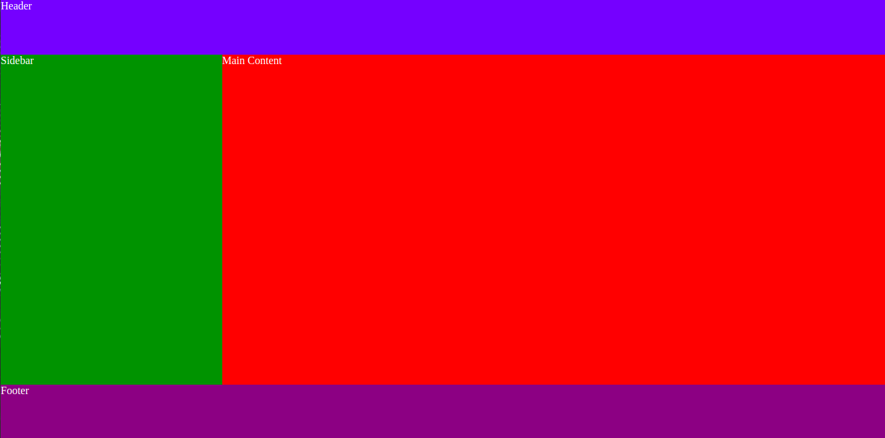

# Model the Boxes

**Instructions**:

1. Create `html` and `css` files. Work from there.

2.  Create the layout shown in the image below:
   
    

3.  Use `<header>`, `<main>`, `<footer>`, `<aside>` to structure the html page.
